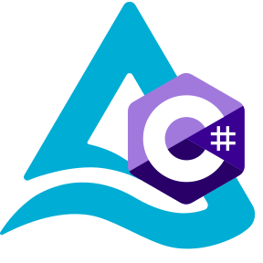

<p align="center">
    
</p>
<p align="center">
A dotnet library for Delta Lake.
</p>

## Introduction

This project uses Delta Lake, an open-source storage layer that brings ACID (Atomicity, Consistency, Isolation, Durability) transactions to big data workloads.

Delta Lake provides the ability to perform batch and streaming workloads on a single platform with high reliability and performance. It offers schema enforcement and evolution, ensuring data integrity. It also provides a full historical audit trail of all the changes made to the data.

## Getting Started

### Install the package

```pwsh
dotnet add package DeltaLake
```

## Usage

### Reading a table

```csharp
import DeltaLake;

var table = new DeltaTable.Builder()
    .WithFileSystem("file:///path/to/table")
    .Build();

await foreach (var batch in table.GetRecordBatches())
{

}
```

### Reading a typed table

```cs
record FooTable : ITable<Foo>
{

    public static Schema Schema { get; } = new([
        new("id", Int32Type.Default, false, []),
        new("foo", StringType.Default, true, [])
    ], []);

    public static IEnumerable<TestTable> Enumerate(RecordBatch batch)
    {
        for (int i = 0; i < batch.Length; i++)
        {
            var idArray = batch.Column(0) as IReadOnlyList<int?> ?? throw new Exception("Expected non-null array");
            var fooArray = batch.Column(1) as IReadOnlyList<string?> ?? throw new Exception("Expected non-null array");
            yield return new TestTable()
            {
                Id = idArray[i] ?? throw new Exception("Cannot be null"),
                Foo = fooArray[i]
            };
        }
    }
}

var table = new DeltaTable<FooTable>.Builder()
    .WithFileSystem("file:///path/to/table")
    .Build();

await foreach (var row in table.ReadAll())
{
    Console.WriteLine("{0}", row);
}

```

### Create a table

```cs
import DeltaLake;

var table = new DeltaTable.Builder()
    .WithFileSystem("file:///path/to/table")
    .WithSchema(schema)
    .EnsureCreated()
    .Build();

```

### Update a table

```cs
import DeltaLake;

table = ...;

using var data = new RecordBatch(table.Schema, [
    new Int32Array
        .Builder()
        .Append(1)
        .Append(2)
        .Append(3)
        .Build(),
    new StringArray
        .Builder()
        .Append("one")
        .AppendNull()
        .Append("two")
        .Build(),
], 3);

table = new DeltaTable.Builder()
    .FromTable(table)
    .Add(data)
    .Build();

```


